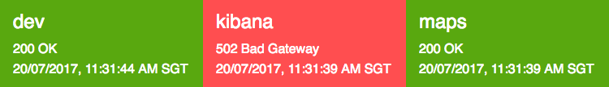

# rcanary

[](https://travis-ci.org/gyng/rcanary)

A minimal program to monitor statuses of webpages, with super-basic logging and email alerts via SMTP. Supports basic auth for HTTP targets. rcanary exposes a websocket server for dashboards to connect to.

# Usage

## As a program

    git clone https://github.com/gyng/rcanary.git
    cd rcanary
    cargo run --release my_config.toml

Configure settings and the targets to probe in the configuration toml passed in to the program. An example is in [`tests/fixtures/config.toml`](tests/fixtures/config.toml).

## As a library

Structs used in rcanary are exported in a library for ease of use in other Rust programs. Add this to your dependencies in `Cargo.toml`:

```toml
librcanary = { git = "https://github.com/gyng/rcanary" }
```

```rust
extern crate librcanary;

fn main {
    println!("Hello, {:?}!", librcanary::Status::Fire);
}
```

## Basic auth

Add this below any target in `config.toml`

```toml
[targets.http.basic_auth]
username = "bigboss"
password = "secret"
```

## Email alerts

Email alerts will fire once when an error is detected, and again when the error has been resolved.

```
rcanary alert for https://www.example.com

🔥 Something has gone terribly wrong:
CanaryCheck {
    target: CanaryTarget {
        name: "Production",
        host: "https://www.example.com",
        interval_s: 30,
        alert: true,
        basic_auth: None
    },
    status: Fire,
    status_code: "500 Internal Server Error",
    time: "2017-07-15T04:37:04Z",
    alert: true,
    need_to_alert: true
}
```

### Gmail
SMTP configuration for Gmail can be found [here](https://support.google.com/a/answer/176600). Additional details on using Gmail SMTP can be found [here](https://www.digitalocean.com/community/tutorials/how-to-use-google-s-smtp-server). You might also need to [enable less secure apps](https://support.google.com/accounts/answer/6010255?hl=en). The example [`config.toml`](tests/fixtures/config.toml) has some defaults set for Gmail.

## Docker

[Docker Hub](https://hub.docker.com/r/gyng/rcanary/)

```
docker pull gyng/rcanary
```

By default, the image will mount a volume at `/app/config` and use `/app/config/config.toml`. Note that the configuration file is assumed to be at `config/config.toml` on the host.

Then, you can run it as such using:

    docker build -t rcanary .
    docker run -v /path/to/config:/app/config rcanary

    # Or use docker-compose
    docker-compose up

You will need at least Docker engine version 17.05 (API version 1.29) to build the image.

## Logging

All log output is sent to `stdout`. The Docker image also `tee`s the log output into files in the `logs` volume. To do it without Docker, pipe the output into a file with `tee`:

    cargo run --release -- /app/config/config.toml | tee "/app/logs/`date +%s`.log"

Note: the logger overrides `RUST_LOG` to be `info`.

## Dashboard



An example dashboard is at [`src/dashboard/index.html`](src/dashboard/index.html). By default it connects to port `8099` on the current hostname.

    http://localhost
    connects to => ws://localhost:8099

    https://my.dashboard.example.com
    connects to => wss://my.dashboard.example.com:8099

### Specific rcanary server

To specify a rcanary instance to connect to, add a `server` parameter to the URL:

    http://my.dashboard.example.com?server=ws://my.rcanary.example.com:8888
    connects to => ws://my.rcanary.example.com:8888

### Filtering targets

To display specific targets based off a tag Regex, add a `filter` parameter to the URL. This parameter defaults to `.*` (match all targets) if it is not provided or the regex is invalid.

    http://my.dashboard.example.com?filter=showme-.*
    shows only targets with tags that match the regular expression

The parameters can be combined.

### Notifications

To use notifications, add `notifications=true` to the URL. Notifications are disabled by default.

    http://my.dashboard.example.com?notifications=true

Notifications will only show up after initial state has been seeded, and only if notification permissions are granted. State changes are notified.

## Health check endpoint

Set `health_check_address` in your configuration file for a HTTP health check endpoint to bind to. The health check endpoint will only run if the key is present and will return a HTTP 200 response containing the word `OK`.

    health_check_address = "127.0.0.1:8100"

# License

MIT. See `LICENSE` for details.
